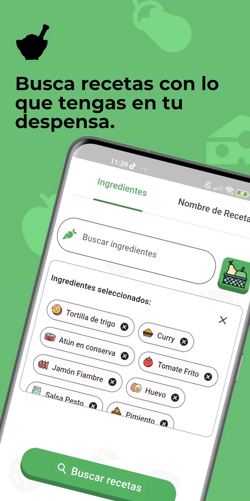
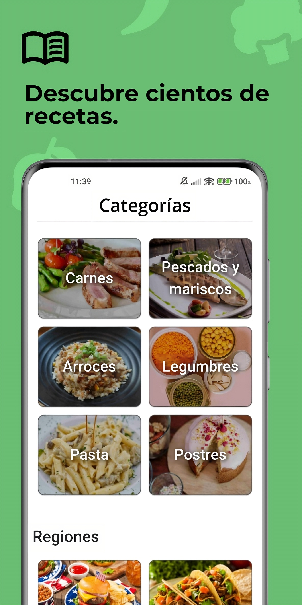
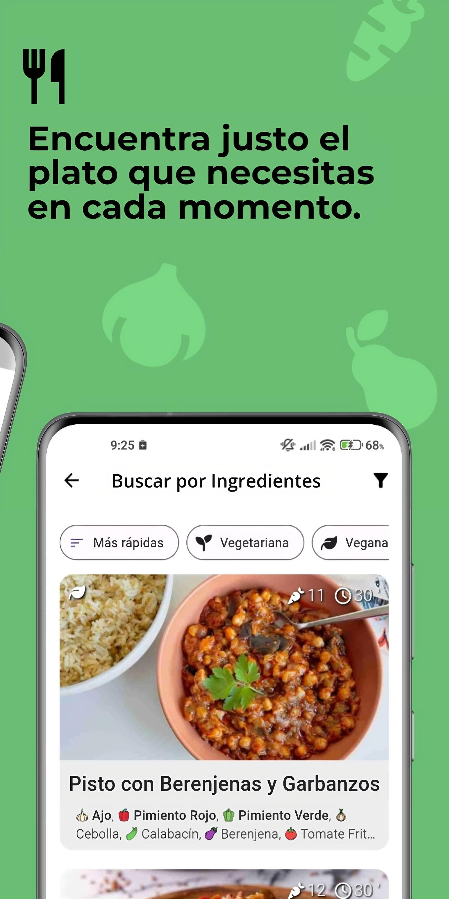
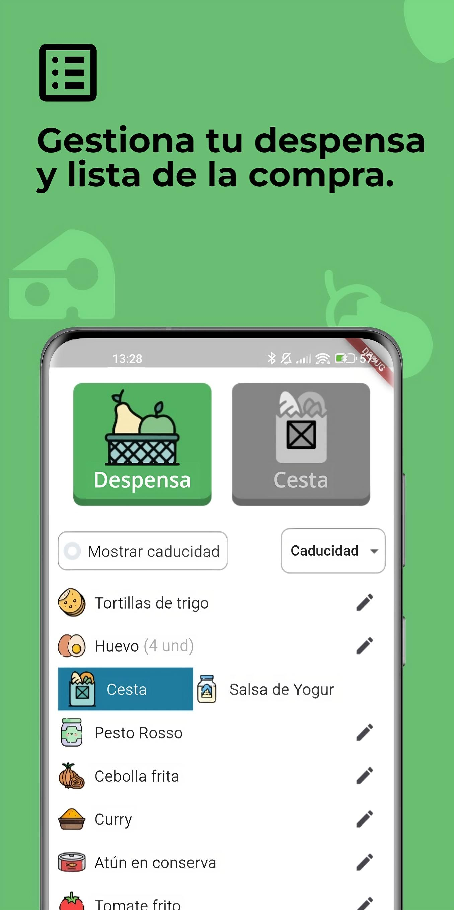
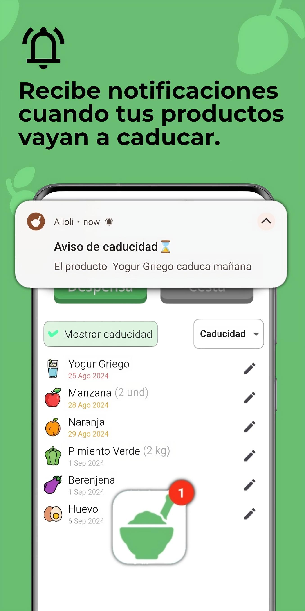
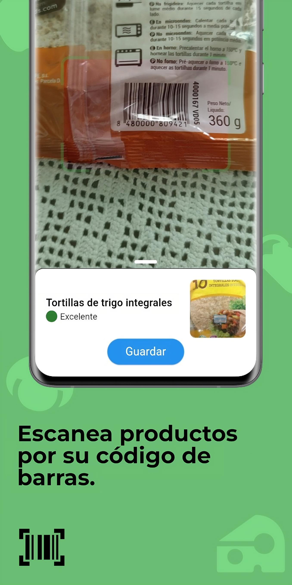

[Español](#wordel---aplicación-en-flutter)

# Alioli - Flutter App

Alioli is a food app that aims to centralize different recipe and product functionalities in one place.

Built with Flutter and Firebase, it includes the use of design patterns, NoSQL and SQLite databases, and integration with external APIs.

Download by clicking on the following image:

## 📸 Screenshots

    
    
    

    
    
    

## 📌 Features
With Alioli you can:

🛒 Organize your pantry food list, as well as your shopping list.
📅 Receive notifications when your products are close to their expiration date.
🔍 Scan the barcode of the products to get a summary of their nutritional information.
🥕 Search for recipes based on the foods in your pantry, among other search criteria such as recipe name or category to which they belong.
🔧 Apply a multitude of filters to searches, classifying them by vegan, vegetarian, preparation time, best rating or existence of videos among other filters.
📚 Create your own personalized recipe lists.
⬆️ Upload your own recipes to the platform so that they can be accessible by everyone.

# WORDEL - Aplicación en Flutter

 Alioli es una aplicación sobre alimentación que trata de centralizar distintas funcionalidades sobre recetas y productos en un solo lugar.

Realizada con Flutter y Firebase, incluye el uso de patrones de diseño, bases de datos NoSQL y SQLite e integración con apis externas.

Descargar haciendo click sobre la siguiente imagen:

## 📸 Capturas

    
    
    

    
    
    

## 📌 Características
Con Alioli puedes:

🛒 Organizar tu lista de alimentos en despensa, así como tu lista de la compra.
📅 Recibir notificaciones cuando tus productos estén próximos a su fecha de caducidad.
🔍 Escanear el código de barras de los productos para obtener un resumen de su información nutricional.
🥕 Buscar recetas basadas en los alimentos de tu despensa, entre otros criterios de búsqueda como nombre de la receta o categoría a la que pertenecen.
🔧 Aplicar multitud de filtros a las búsquedas, clasificándolas por veganas, vegetarianas, tiempo de preparación, mejor valoración o existencia de vídeos entre otros filtros.
📚 Crear tus propias listas de recetas personalizadas.
⬆️ Subir tus propias recetas a la plataforma para que puedan ser accesibles por todo el mundo.
